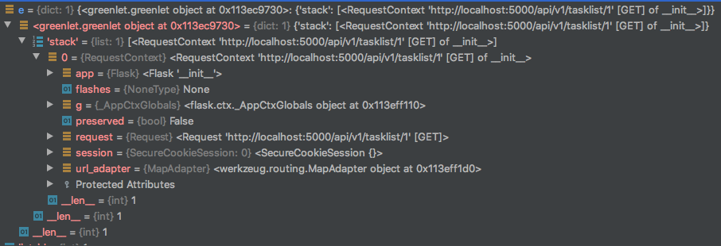

# Lecture 10 - Flask, REST  

*Flask* - микрофреймворк для веба.  
### Hello, Flask!
hello_flask.py  
```python
from flask import Flask
from werkzeug.serving import run_simple

app = Flask(__name__)

@app.route('/')
def index():
    return 'Hello World!'

if __name__ == '__main__':
    run_simple('localhost', 5000, app)  
```  

Что произошло:
* Создали инстанс класса Flask  
  class Flask - точка входа обработки полученного сервером http-запроса   
  Реализует контракт `WSGI callable`    
* Настроили url-маршрутизацию
  Если URL-путь совпадает с одним из заданных шаблонов маршрутизацию, будет вызвана привязанная к нему функция  
  Такие функции называются `view`  
* Отправляем наш WSGI callable на исполнение в сервер  
  Сам по себе Flask не будет сервить себя 

Формат view-функции:  
```python
@app.route('/music/')
def view_one():
    return <response_body>, <response_code>, <response_dict>
```

### Прокси и контексты

Вся машинерия фласка вертится внутри цикла "запрос-ответ".  
Приложение может обслуживаться 1..N потоками - каждый запрос приходит на свой поток.  
Состояние каждого цикла можно держать в thread-local глобальных переменных.
Передавать request в каждую функцию (django-way) или сделать некую глобальную проксю (flask).  
Flask-way warning - циклические зависимости при импорте:    
```python
# snake.py
import tail

# tail.py
import snake
```
Решение:  
* Завести глобальные "thread-local" стеки
* Трактовать их для обработки запросов как стекфреймы у python-функций
* Расширения и внутренняя машинерия управляет состояниями этих стеков
* Оба cтека каждый раз создается заново  
* Сделать указатели на эти стеки
* Состояние стеков волатильно во время обработки запроса
    
*Контексты - самое противоречивое решение во фласке*.  
Прекрасная идея, но описано крайне плохо.  
  
Контексты Flask и доступные из них объекты
* current_app - ApplicationContext - активное приложение
* g - ApplicationContext - дескриптор, доступный во время обработки запроса
* request - RequestContext - объект активного запроса в обработке
* session - RequestContext - "состояние" клиента (из cookies), сохраняющееся между запросами

Последствия:  
* Во время инициализации app не изменять ApplicationContext
* Во время обработки запроса не изменять ApplicationContext
* Хранить глобальные объекты в ApplicationContext нет смысла - все равно потеряешь
* Если нужно что-то прикрепить к текущему app на время обработки запроса - юзаем g, а не current_app
* `app` напрямую используется только при инициализации всех расширений  
* Можно держать на одном интерпретаторе несколько app и пайплайнить запросы



```python
from flask import Flask, request
app = Flask(__name__)
@app.route("/order")
def order_form():
    if request.method == 'POST':
        # update_smth(...)
    else:
        pass
```  
Смысл трюка с прокси-объектами  
https://pynash.org/2013/02/12/proxy-objects/  
```python
thing = "hi"

class ThingProxy(object):
    def __getattribute__(self, name):
        return getattr(thing, name)

proxy = ThingProxy()
```
Инициализация контекста (через contextmanager/push)
```python
class Flask:
    def wsgi_app(self, environ, start_response):
        ctx = self.request_context(environ)
        error = None
        ctx.push()
        response = self.full_dispatch_request()
        ...
```
https://www.peterspython.com/en/blog/the-mysterious-flask-application-context-my-questions-and-answers

### Flask-плагины
Для интеграции с app, Flask-плагин может сделать следующие шаги:
* Привязать app, на котором расширение будет активно   
* Завести себе глобальное состояние - через словарь app.extensions
* Произвести настройку окружения (sqla пример), завести конфиги в словарь app.config
* Зарегистрировать callback-вызовы - например, закрыть ресурс при завершении запроса

### Маршрутизация
Построена на werkzeug.routing  
Мы задаем набор правил, которые применяются на URL-путь  
Также возможно определять динамические компоненты в правиле - `<converter(arguments):variable_name>`
Доступные конвертеры (werkzeug.routing.___Converter):
* string (по умолчанию)
* int (>=0)
* float (>=0.0)
* path
* uuid  
  
Каноничный URL - `/about_me` превратится в `/about_me/`
  
```python
from werkzeug.routing import Map, Rule, NotFound, RequestRedirect

url_map = Map([
    Rule('/', endpoint='blog/index'),
    Rule('/<int(fixed_digits=4):year>/', endpoint='blog/archive'),
    Rule('/<int:year>/<int:month>/', endpoint='blog/archive'),
    Rule('/<int:year>/<int:month>/<int:day>/', endpoint='blog/archive'),
    Rule('/<int:year>/<int:month>/<int:day>/<slug>',
         endpoint='blog/show_post'),
    Rule('/about', endpoint='blog/about_me'),
    Rule('/feeds/', endpoint='blog/feeds'),
    Rule('/feeds/<feed_name>.rss', endpoint='blog/show_feed')
])

def application(environ, start_response):
    urls = url_map.bind_to_environ(environ)
    try:
        endpoint, args = urls.match()
    except HTTPException as e:
        return e(environ, start_response)
    start_response('200 OK', [('Content-Type', 'text/plain')])
    return ['Rule points to %r with arguments %r' % (endpoint, args)]
```  

### Некоторые паттерны Flask-приложений
#### blueprint
С ростом кодобазы, держать все вьюхи в одном модуле станет тяжко.  
Blueprint - пространство вьюх, которые могут быть позднее подключены к приложению.  
Это дает возможность:  
* подключать его на несколько url-пространств/поддоменов
* иметь свои шаблоны/статику/функции шаблонизатора

#### application_factory

  
## Кейс на реализацию  
```
Task Tracker

/api/tasklist?order={desc}
GET - получить все TODO-списки
POST - создать новый TODO-список

/api/tasklist/<int:id>?order={desc}
GET - получить список по $id
PATCH - обновить список по $id
DELETE - удалить список по $id

/api/tasklist/<int:id>/<int:pos>
GET - получить задачу $pos из списка $id
PATCH - обновить задачу $pos из списка $id
DELETE - удалить задачу $pos из списка $id
```
Модель данных:  
```
TaskList
    list_id: int,
    list_name: str,
    created_dttm: datetime,
    description: str

Task
    task_id: int
    list_id: int (fk)
    task_value: str
    created_dttm: datetime
```


## REST principles
REST-принципы:  
* клиент-серверность
* stateless - сервер не хранит состояния для клиента
* кэшируемость
* единообразный интерфейс
* распределенность - нет привязки к одному серваку

*Ресурс* - ключевая абстракция (контент/сервис/...)  
Имеет идентификатор и методы.  
Методы обычно соотносят с методами HTTP - GET/POST/...    

*REST != HTTP*  
Ничего не мешает сделать REST поверх TCP, это всего лишь архитектурный паттерн  

Для чего REST - robot-friendly интерфейс систем, для интеграций, для тонких клиентов:
* интеграционные сервисы - связать две разных системы (пример: фронт-офис и кредитная фабрика)  
* backend мобильных приложений
* rich web apps (react/vue/...)

https://restfulapi.net/rest-architectural-constraints  

### SQLAlchemy basics

### Flask CLI

## Шаблонизация - Jinja  
Шаблоном может быть любой plain text  
Чаще всего применяется для динамизации HTML  

В Jinja есть два понятия:  
* контект - контейнер функций и объектов
* filter - f(x)
* variable - некое значение (объект)

Инстансы Flask содержат в себе контекст, дополнить фильтрами через декоратор `app.template_filter`     
  
https://blog.miguelgrinberg.com/post/the-flask-mega-tutorial-part-ii-templates  

## Формы
  
## Авторизация & cессия


