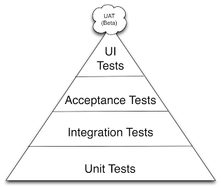

# Lecture 13 - continuous integration & delivery, devops  
 
## Continuous Integration (CI) 
Переводят как `непрерывная интеграция`, и зачастую вредно воспринимать перевод буквально.    
В произвольный момент времени мы всегда имеем актуальный код, в котором косяки были минимализированы  
    
Концепцию популяризовал Фаулер (2006), но зародилась она в 90х (Kent Beck's XP, Grady Booch):  
https://martinfowler.com/articles/continuousIntegration.html  
```
Continuous Integration (CI) is a development practice that requires developers to integrate code 
into a shared repository several times a day. Each check-in is then verified by an automated build, 
allowing teams to detect problems early. 
```

*Just to recap - пирамида тестов*  
дороговизна, окупаемость, число тестов.   
[Q] - как оно бьется на картинке?    
  
    
    Unit тесты - тестируем работу класса без взаимодействия с другими компонентами системы
    
    Integration тесты - проверяем корректность совместной работы нескольких модулей 
    
    Acceptance Tests (AT) - приемочные тесты, описывающие требования и ожидания
       * Спецификации - cucumber и прочие BDD-инструменты
       * UI тесты (Selenium)
    

### Принципы CI
*Maintain a single source repository*    
Сейчас это норма жизни, есть бесплатные github, gitlab, bitbucket, ....
Также доступно и для on-premise - gitlab например.      
  
*Automate the build*  
Больше актуально для древних компилируемых языков.    
Сделать make-скрипт, который как надо компилирует.   
Либо настроить систему сборки (CMake, Maven, ...)  
   
*Make your build self-testing*  
Иметь под рукой набор тестов - юнит, интеграционных, ...  
Хоть что-нибудь, что позволило бы предотвращать появление нерабочего кода, банальных косяков, наступление на старые ошибки и тд    

*Every commit should build on an integration machine*    
Делайте коммиты чаще, избегайте мега-коммитов.   
Так будет проще отслеживать историю изменений, без потерь разрешать конфликты.    
  
*Keep the build fast*   
Обычно всегда соблюдается, пока в вашем проекте условно не станет  > ~1M строк кода.   
Например, 30 мин сборки android яндекс-браузера - https://m.habr.com/en/company/yandex/blog/343278/    
Решается кластерной сборочной системой и сборочным DAG
  
*Test in a clone of the production environment*  
Звучит очевидно. Всегда стараться поддерживать однообразие среды.    
Docker, Kubernetes & Openshift  
   
*Make it easy for anyone to get the latest executable version*  
Используем хранилище сборочных артефактов - nexus, gitlab, artifactory, ...  
  
*Everyone can see what’s happening*  
Следствие предыдущих пунктов. Есть SCM, сборочная система, артефактори - все прозрачно и доступно    
  
*Automate deployment*  
Если нужно производить acceptance-тесты в разных средах, неплохо бы сделать развертывание этих сред воспроизводимым.  
  
### Внедрение CI в работу  
Без 100% принятия среди команды, CI сможет принести не только плоды, но и дополнительные проблемки.  
* жирные коммиты тяжело ревьюить
* если некто не прогнал/отключил тесты перед пушем в репу
* если деплой упал, а на часах 17:58 (я осьминог, пришел в 9 и мне пора домой)
  
Решается через командные "ритуалы", перфоманс ревью, и тд.  

Отличный инструмент *Git hooks*, и примеры использования   
* commit-msg - валидация комментария коммита  
* pre-commit - выполнить все подготовительные действия (линтеры, ...) и проверки - перед совершением коммита    
  https://pre-commit.com/  
* post-checkout - проверка branch naming

## Continuous delivery, continuous deployment
Воспроизводимый процесс доставки новых версий проекта (по кнопке).  
Частый паттерн - как только все тестирования и ревью были проведены, изменения принимаются в main-ветвь.  
В зависимости от объема изменений в новой версии, эти термины различаются:  
* delivery - развертывание автоматизировано и доступен по кнопке (релиз)
* deployment - развертывание происходит сразу же после одобрения коммита
  требует практически идеального QA и ведения документации.  

## CI/CD + SCM  
Рассмотрим Gitlab CI  
https://docs.gitlab.com/ee/development/architecture.html  

Описание файла конфигурации  
https://docs.gitlab.com/ee/ci/yaml/README.html#configuration-parameters  
  


## Менеджер артефактов - Nexus


## systemd

 
