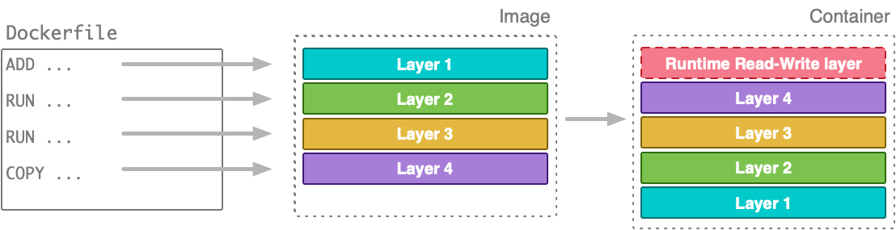
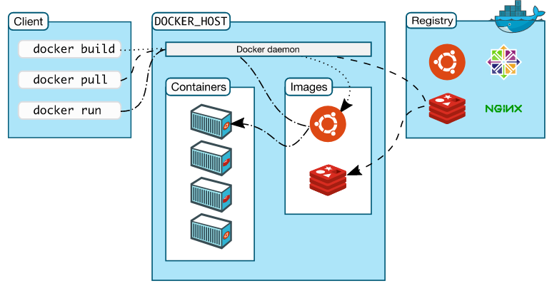
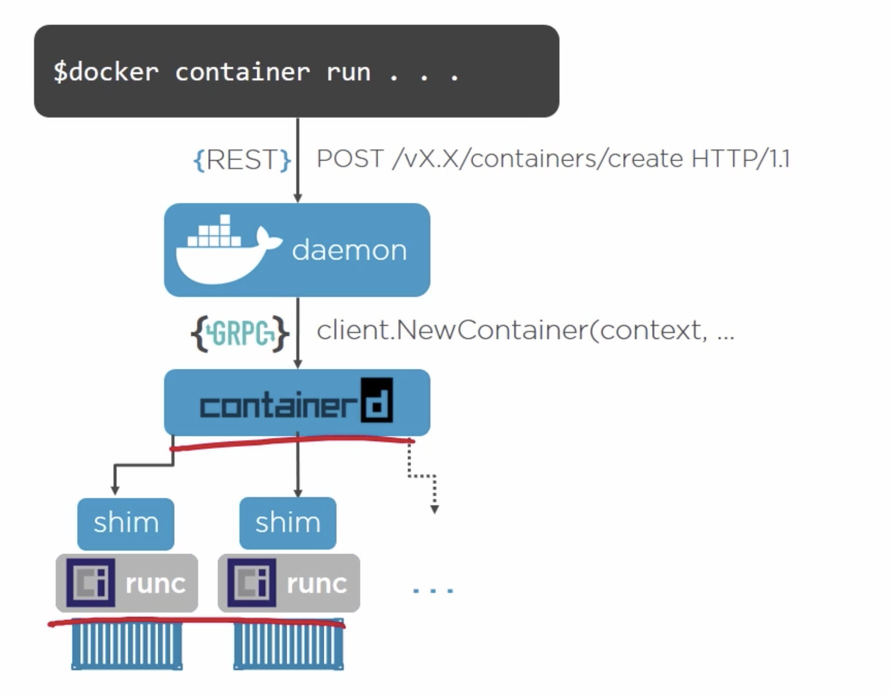
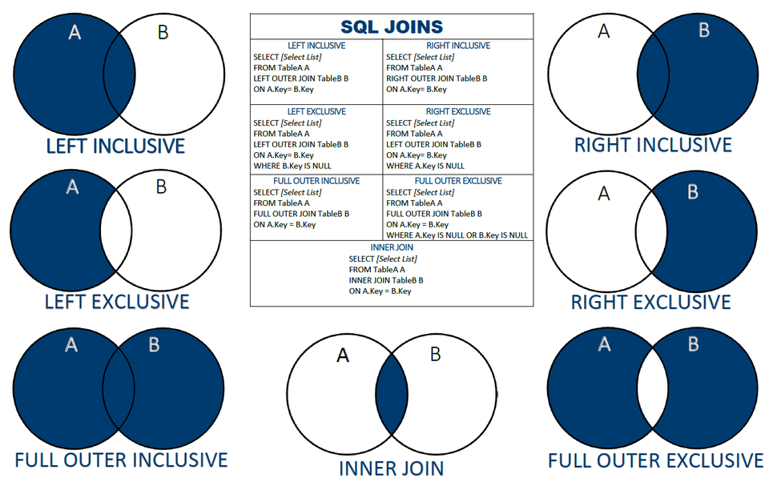
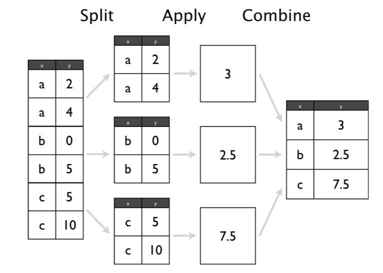

# Lecture 7 - Docker

Всем привет!
Начнем нашу лекцию с Docker. Какие задачи привели к его появлению  
  
## Развертывание окружения
Наверняка всем приходилось переустанавливать ОС, и заново все накатывать (драйверы, софт, и тп).  
Рутинное занятие?  
Как можно сделать это процесс воспроизводимым?  
- сохранить некий образ (recovery partition)  
- автоматизация (скрипты)   
Появилось множество продуктов, подходящих под конкретный кейс (слышали про Acronis, Puppet/Chef, Ansible).  
Но где появляется результат этого процесса? Нужно некое железо (сервер, ваш ноутбук).  
Здесь мы задумываемся о задаче виртуализации  

## Виртуализация
 *  В конце 90х рынок изменился, от дорогих мейнфреймов компании   
    стали использовать обычные сервера и современные ОС - потому что дешевле.  
    От использования неподходящего старого софта не всегда можно отказаться, что  
    влекло за собой проблему - где все это запускать?  
    Похожий пример из игровой индустрии - эмуляция старых приставок  
    
 *  Физические ресурсы ограничены, и нужно стараться утизировать их на 100%.  
    Представим, что у нас есть 3 компоненты и 2 мощных сервера ()  
    * высоконагруженный веб-сервис  
    * сервер корпоративной почты  
    * набор старых систем (legacy)  
    Мы знаем, что почта и legacy потребляют не больше 30% от ресурсов одного сервера, а веб-сервис - от 30-100%  
    Логичнее было бы разместить почту и легаси на одной тачке. Но как?  
  

Тут и приходит на помощь виртуализация.     
  
Мы запускаем гостевую ОС на эфемерном железе.  
На реальном железе работает ОС-хозяйка, назовем хостом.  
Эфемерное железо предоставляется гипервизором, который может работать внутри хоста (кто не использовал VMWare/Virtualbox?).  
Есть гипервизоры, работающие на голом железе - тогда они совмещают функции хоста-ОС и виртуализации (Citrix Xen, IBM).  
Виртуализация позволила:  
* повысить плотность размещения (сколько же KVM-серваков работают на одном физическом серваке в хостингах)  
* создания нужной среды исполнения - runtime env  

Тем не менее, процесс достаточно тяжеловесный (мы эмулируем практически все 'девайсы', которые видит гостевая ОС).  
И все также надо установливать каждый рах операционку и что-то накатывать.  
А стоимость виртуализации (overhead) достаточно высока (сколько виртуалок вы сможете одновременно запустить на вашем ноуте)  
Я как-то запускал два виртаулбокса с виндой и ораклом на core i5-2520m, было еще то слайдшоу.  

А теперь пристегнитесь, мы переносимся в эпоху контейнеров!  


## Containers
```
- Что общего между devops-ом и бомжом?
- Оба хорошо разбираются в контейнерах
```
В предыдущем разделе мы говорили о виртуализации железа, и поняли что это довольно накладно.  
### Виртуализация ОС
Зачем виртуализировать сетевую карту, жесткий диск - когда это уже есть физически?  
*Вызов 1 - Не пора ли виртуализировать вместо железа саму операционную систему?*  
Так появляется виртуализация ОС (OpenVZ - VPS, LXC, CoreOS, Docker)   
Ее главные особенности:   
* Нет эмуляции железа, процессы в контейнерах исполняются на железе хоста.  
* Упор на изоляцию - примеры:  
    * PID namespace - процесс в контейнере исполняется как процесс хоста, но на хосте у него один PID, а в контейнере другой  
    * Свои пользователи и группы (/etc/passwd, group)  
    * Своя системная среда (/bin, /lib, /usr/lib, /usr/bin)  
* Ресурсы под контролем - контейнер точно не съест 100% процессорного времени  
```
// снаружи
USER     PID             VIRT   RSS
root      1375  0.0  0.2 836532 44320 ?        Ssl  Mar31  20:17 /usr/bin/containerd
root     21533  0.0  0.0 109096  8124 ?        Sl   Apr01   0:48  \_ containerd-shim -namespace moby -workdir /var/lib/containerd/io.containerd.runtime.v1.linux/moby/f0d17c83f6
polkitd  21564  0.0  0.1 287444 17664 ?        Ss   Apr01   0:02  |   \_ postgres
polkitd  21776  0.0  0.0 287444  2040 ?        Ss   Apr01   0:00  |       \_ postgres: checkpointer process  
polkitd  21777  0.0  0.0 287444  3088 ?        Ss   Apr01   0:20  |       \_ postgres: writer process  
polkitd  21778  0.0  0.0 287444  2048 ?        Ss   Apr01   0:21  |       \_ postgres: wal writer process  
polkitd  21779  0.0  0.0 287856  2772 ?        Ss   Apr01   0:08  |       \_ postgres: autovacuum launcher process  
polkitd  21780  0.0  0.0 142444  1996 ?        Ss   Apr01   0:06  |       \_ postgres: stats collector process
// внутри контейнера
postgres     1  0.0  0.1 287444 17664 ?        Ss   Apr01   0:02 postgres
postgres    26  0.0  0.0 287444  2040 ?        Ss   Apr01   0:00 postgres: checkpointer process  
postgres    27  0.0  0.0 287444  3088 ?        Ss   Apr01   0:20 postgres: writer process  
postgres    28  0.0  0.0 287444  2048 ?        Ss   Apr01   0:21 postgres: wal writer process  
postgres    29  0.0  0.0 287856  2772 ?        Ss   Apr01   0:08 postgres: autovacuum launcher process  
postgres    30  0.0  0.0 142444  1996 ?        Ss   Apr01   0:06 postgres: stats collector process   
```  

### Проблема развертывания (again)
В мире стало много софта, и одно зависит от чего-то другого.  
Было ли у вас такое, когда вы ставили пакет, который ломал все зависимости в ОС (Ubuntu и другие линуксы)?  
Или в винде - обновили какой нибудь рантайм (MSVC) и часть программ потеряла нужные библиотеки?  
Про пакеты в python/js я вообще помолчу.  

Проблема воспоизводимости развертывания окружения стала еще сложнее.  
Обычными скриптами и разрешением конфликтов зависимостей уже не справишься.  
*Вызов 2 - Упростить развертывание окружения и дать изолированную среду исполнения*  

Сегодня мы рассмотрим *Docker* - дефакто стандарт для развертывания и запуска сервисов.   
  
## Docker itself  
Почему docker стал стандартом в индустрии?  
Упор был сделан на более широкую аудиторию (не только инфраструктура).  
Публика получила all-in-one инструмент, позволяющий:   
* собрать среду (помните те админские скрипты) - получить образ (image)  
* запустить среду - взять image и получить контейнер  
* сопровождать - контейнер всегда можно останавливать, перезапускать, перетаскивать между тачками  
* переиспользовать - образы можно выкладывать как обычный артефакт, собирать новые образы на основе других  
* многое другое - логирование, реестр образов, кластеризация, ...  
  
  
## Docker Components 
Рассмотрим подробнее ключевые абстракции в docker:  
* image
* container

## Image
Образ задает наполнение файловой системы для контейнеров. Подобно установке ОС на виртуалку.  
Самый удобный способ описать образ - использовать формат Dockerfile.  
Создадим для сборки отдельный каталог - он является *контекстом сборки*  
```shell script
cd ~
mkdir try-dockerfile && cd try-dockerfile
touch Dockerfile 
```
Одно действие - одна строка, и синтаксис инструкции очень простой:  
```
INSTRUCTION arg1 ... argN
```
Каждый докерфайл начинается с оператора `FROM`. Он определяет родительский образ.  
Здесь мы указываем базовый образ, если такого нет - указываем `scratch`. Тогда мы сделаем свой базовый образ.  

Для дальнейших примеров возьмем Busybox - базовый набор Linux-окружения, и сделаем свой родительский образ  
Файл находится в каталоге этой лекции.  
```dockerfile
FROM scratch
# ADD - копируем файлы из контекста и вложенных папок. 
# Из родительского каталога не можем
# ADD может скачивать файлы по HTTP и извлекать стандартные TAR-архивы
ADD busybox.tar.xz /
RUN echo "123" > /var/log1
RUN echo "456" > /var/log2
# Команда, запускающаяся по умолчанию при запуске контейнера на основе этого образа
ENTRYPOINT ["/bin/sh"] 
```
Большинство стандартных базовых образов - ubuntu,debian,... собираются примерно таким образом.  
Только предварительно формируется нужный rootfs-архив.  

Давайте соберем образ  
```
[lancer@sedna1 workshop]$ docker build  --force-rm --no-cache -t my-busybox .
#### -force-rm --no-cache --> удалить промежуточные слои и не использовать кэш при сборке
#### -t --> дать метку образу
Sending build context to Docker daemon  637.4kB 
#### Все содержимое контекста копируется. Исключить файлы можно через .dockerignore 
Step 1/5 : FROM scratch
 --->
#### Каждое выражение порождает временные слои. При пересборке часть временных данных 
Step 2/5 : ADD busybox.tar.xz /
 ---> 7651a6493b2b
Step 3/5 : RUN echo "123" > /var/log1
 ---> 278311d90dca
Step 4/5 : RUN echo "456" > /var/log2
 ---> 56ed628b09e0
Step 5/5 : ENTRYPOINT ["/bin/sh"]
 ---> 95779d15048d
Successfully built 95779d15048d
Successfully tagged my-busybox:latest
```  
*Каждый шаг генерирует отдельный слой изменения данных*  
Основные операторы Dockerfile:  
* FROM - задаем базовый образ
* RUN - выполнить действие (команда интерпретатора)
* ADD/COPY - скопировать файл из контекста. Разница между ними - COPY может иметь несколько назначений
* ARG - внешний параметр. Помогает избегать хардкода, значение передается из параметра `--build-arg MY_ARG=MY_VALUE`
* ENV - задать константу. Помогает избегать хардкода
* ENTRYPOINT/CMD - что запускать при запуске контейнера. Лучше задавать как список - `["val1", "cmd2", ... ]`
* SHELL - инициализация командного интерпретатор. По умолчанию - `["/bin/sh", "-c"]`

Если задан только CMD, то происходит запуск вида `SHELL CMD`.  
Если задан ENTRYPOINT, и если дополнительно CMD - запуск вида `ENTRYPOINT CMD`, иначе `ENTRYPOINT`  

*Запомним - один раз собрав образ, редактировать его нельзя. Только заново собирать*  

## Container 101
Контейнер можно понимать как экземпляр класса в Python, а образ - определение этого класса.  
Его можно запускать, останавливать, экспортировать, импортировать.  

## UnionFS
Каждый контейнер имеет свой "жесткий диск". Но не как у обычных виртуальных машин.  
Контейнер создается из образа, который имеет свой "слои" данных.   
В ходе своей жизни, файлы внутри могу изменяться и все это хранится как дополнительные слои.  
  

Давайте изменим наш докерфайл - уберем из него строки "echo", соберем и проинспектируем его.  
Найдем строку с RootFS. 1 действие при сборке - 1 слой.   

```
"RootFS": {
            "Type": "layers",
            "Layers": [
                "sha256:6c0ea40aef9d2795f922f4e8642f0cd9ffb9404e6f3214693a1fd45489f38b44"
            ]
        },
``` 

*Задачка*  
```
Родительский образ собрался в 5 действий. Дочерний - в 12.   
Сколько слоев будет в дочернем образе?
```

## Container launch  
```shell script
docker run [OPTIONS] IMAGE [COMMAND] [ARG...]
```
Основные параметры:  
https://docs.docker.com/engine/reference/commandline/run/#options  
  
* --name
* --rm  
  
* --volume , -v  
  
* --interactive , -i
* --tty , -t  
  
* --detach     
  
* --entrypoint
* --env , -e
* --expose  

COMMAND, ARG... - синонимично CMD из Dockerfile.  
Если задан ENTRYPOINT в файле, то COMMAND, ARG пойдут как аргументы для ENTRYPOINT  
  
## Bind mounts
Докер также позволяет работать контейнерам работать с host-каталогами.  
Их нужно примонтировать с помощью опции `-v`:  
```
-v <absolute_host_path>:<absolute_guest_path>
```

  
## Docker Registry
Образы могут быть переиспользованы. Вполне себе артефакт.  
Артефакты хранятся на специальных сервисах - registry.  
Это может быть DockerHub (как PyPI в питоне), или же что-то свое корпоративное (Nexus, Gitlab, ...)  
  
Dockerhub является registry по умолчанию, и пожалуй это самое большое хранилище docker-образов.  
```
docker pull <image_name>
<image_name> = имя:метка

docker pull nginx
docker images
```
Образы можно сохранять самому, достаточно сделать две вещи  
```
docker login   # войти в DockerHub
docker push <image_name>
```

## Архитектура Docker
Docker - клиент-серверная штука.  
  
### dockerd
Верхнеуровневый демон, принимающий запросы от клиентов через HTTP и сокеты  
### docker
CLI, работающий в основном по сокету с демоном.  
Именно поэтому вам нужно было сделать `usermod -aG docker $UID` - чтобы иметь права на запись в этот сокет  
### containerd
Низкоуровневый демон, делающий всю работу с контейнерами и образами.  
  


  
## Docker Compose
Командный интерфейс докера богат, и даже слишком.  
Поэтому появился Compose - способ записать действия в докере в виде YAML-файла.  
https://docs.docker.com/compose/compose-file/  
  
```
pip install docker-compose
```
  
TLDR - ничего сверхъестественного. Даже удобней.  
*Житейская мудрость - сразу описывать в compose, если контейнер будет переиспользоваться!* 

# SQL & PostgreSQL
*Disclaimer - воспринимайте ниже идущее как закуску*
*В мире есть много прекрасных книг по SQL, которые вы сможете осилить и осознать после этой закуски*

## Настройка окружения
```
docker pull postgres:9.6
mkdir /home/lancer/workshop/pgdata
curl https://edu.postgrespro.ru/demo-small.zip --output /home/lancer/workshop/pgdata/demo.zip
unzip /home/lancer/workshop/pgdata/demo.zip
chmod o+w demo-small-20170815.sql

docker run -d --name localpg \
  -e POSTGRES_PASSWORD=megavaz -e PGDATA=/var/lib/postgresql/data/pgdata \
  -v /home/lancer/workshop/pgdata:/var/lib/postgresql/data/pgdata
  postgres:9.6
# проверим жив ли контейнер
docker ps -a
# можем глянуть на логи 
docker logs localpg
# прицепимся к контейнеру
docker exec -it localpg /bin/bash
su - postgres
psql -f /var/lib/postgresql/data/pgdata/demo-small-20170815.sql -U postgres

> psql
postgres=# \c postgres
You are now connected to database "postgres" as user "postgres".
postgres=# \d
No relations found.
postgres=# \c demo
You are now connected to database "demo" as user "postgres".
demo=# \d
                   List of relations
  Schema  |         Name          |   Type   |  Owner   
----------+-----------------------+----------+----------
 bookings | aircrafts             | view     | postgres
 bookings | aircrafts_data        | table    | postgres
 bookings | airports              | view     | postgres
 bookings | airports_data         | table    | postgres
 bookings | boarding_passes       | table    | postgres
 bookings | bookings              | table    | postgres
 bookings | flights               | table    | postgres
 bookings | flights_flight_id_seq | sequence | postgres
 bookings | flights_v             | view     | postgres
 bookings | routes                | view     | postgres
 bookings | seats                 | table    | postgres
 bookings | ticket_flights        | table    | postgres
 bookings | tickets               | table    | postgres
(13 rows)

```  
  
Диаграмма данных    
https://postgrespro.ru/docs/postgrespro/10/apjs02.html
  
## Разновидности данных
* Неструктурированные данные (Excel, CSV)
* Полуструктурированные данные (Есть схема? А если найду? - JSON, YML, XML)
https://www.w3schools.com/xml/schema_example.asp
* Структурированные данные (реляционные БД)

*excel vs relational model - both tables, but differs*
`# goto excel - excel structured illustration`

Что в реляционной БД:  
```
demo=# select * from bookings.aircrafts_data limit 5;
 aircraft_code |                                  model                              | range 
---------------+---------------------------------------------------------------------+-------
 773           | {"en": "Boeing 777-300", "ru": "Боинг 777-300"}                     | 11100
 763           | {"en": "Boeing 767-300", "ru": "Боинг 767-300"}                     |  7900
 SU9           | {"en": "Sukhoi Superjet-100", "ru": "Сухой Суперджет-100"}          |  3000
 320           | {"en": "Airbus A320-200", "ru": "Аэробус A320-200"}                 |  5700
 321           | {"en": "Airbus A321-200", "ru": "Аэробус A321-200"}                 |  5600
(5 rows)

demo=# \d bookings.aircrafts_data
     Table "bookings.aircrafts_data"
    Column     |     Type     | Modifiers 
---------------+--------------+-----------
 aircraft_code | character(3) | not null
 model         | jsonb        | not null
 range         | integer      | not null
```
  
# SQL
Язык декларативный
Мы описываем то, что хотим получить - выборку данных -  какие поля, из каких таблиц, что убрать, как подсоединить.
В sql мы можем описать свое желание "глаголом":
Указать данные (data definition language, DDL):
* CREATE 
* ALTER
* DROP
Изменить данные (data modification language, DML):
* UPDATE
* DELETE
* INSERT
* SELECT
Контролировать данные (data control language, DCL):
* GRANT/REVOKE

## DML-запрос
Основные операторы (в последовательности выполнения):
* FROM, JOIN
* WHERE
* GROUP BY, HAVING
* SELECT expressions
* ORDER BY
* LIMIT

В порядке синтаксиса:  
* SELECT expressions
* FROM, JOIN
* WHERE
* GROUP BY, HAVING
* ORDER BY
* LIMIT

```sql
/*
Выбрать пассажиров, летавших в более чем 4 города с 2010-09-14
*/

select
     t.passenger_name, t.passenger_id
from bookings.tickets t
    join bookings.ticket_flights tf on t.ticket_no = tf.ticket_no
        join bookings.flights_v f on f.flight_id = tf.flight_id
where f.scheduled_departure::date > '2010-09-14'
group by t.passenger_id, t.passenger_name
having count(distinct f.departure_airport) > 4
order by t.passenger_name
limit 10;
```
  
Как видим - чистым SQL не обойдешься.  
В каждой реляционной БД есть свой диалект, конкретизирующий работы с типами данных и расширяющий набор операций.  

## Типы данных
https://postgrespro.ru/docs/postgrespro/10/datatype  

## Агрегатные функции
Преобразование вектора данных в скалярное значение.  
```postgresql

```

## Соединения (джойны)

Даны две таблицы - t1, t2.   
Их множества колонок - с1, c2.
Придумаем предикат - t1.col1 = t2.col2.  

Можно объединять таблицы при выборке данных на основе предиката.  
Глядя на диаграмму важно помнить - результирующее множество состоит из колонок c1 + c2.

* INNER JOIN - только записи по предикату.
* LEFT (OUTER) JOIN:
    * записи из t1, не удовлетворявшие предикату -> r1. 
      r1.c1 заполнено из значениями из t1, r1.c2 заполнено нулями
    * записи из t1 удовлетворившие предикату -> r2
      r2.c1 заполнено из значениями из t1, r1.c2 заполнено значениями из t2
* RIGHT (OUTER) JOIN - отражение
    * записи из t2, не удовлетворявшие предикату -> r1. 
      r1.c2 заполнено из значениями из t2, r1.c1 заполнено нулями
    * записи из t2 удовлетворившие предикату -> r2
      r2.c2 заполнено из значениями из t2, r1.c1 заполнено значениями из t1
* FULL (OUTER) JOIN - объединение по предикату.
    * записи из t1, не удовлетворявшие предикату -> r1. 
      r1.c1 заполнено из значениями из t1, r1.c2 заполнено нулями
    * записи из t1 удовлетворившие предикату -> r2
      r2.c1 заполнено из значениями из t1, r1.c2 заполнено значениями из t2
    * записи из t2, не удовлетворявшие предикату -> r3. 
      r3.c1 заполнено нулями, r1.c2 заполнено значениями из t2
* CROSS JOIN - декартово произведение

## Операции со множествами
```
select_data_1
set_operation
select_data_2
```
* UNION
* UNION ALL
* INTERSECT
* EXCEPT
```
select 1 as val, 2 as key
union 
select 1 as val, 2 as key

 val | key 
-----+-----
   1 |   2

select 1 as val, 2 as key
union all              
select 1 as val, 2 as key
;
 val | key 
-----+-----
   1 |   2
   1 |   2
```
## Агрегация
TLDR Преобразование вектора в скалярное значение  

Типовые агрегационные функции:  
* count
* sum
* avg
  
## Подзапросы 
* FROM-подзапросы
* скалярные - возвращает одну строку одну колонку
* коррелирующие
* некоррелирующие
  
## sqlalchemy
https://docs.sqlalchemy.org/en/13/core/tutorial.html

  
# to read
* насколько термин 'виртуализация' перегружен - https://www.redhat.com/en/topics/virtualization/what-is-virtualization
* ENTRYPOINT/CMD - https://docs.docker.com/engine/reference/builder/#understand-how-cmd-and-entrypoint-interact
* пожалуй лучшая книга по sql - https://edu.postgrespro.ru/sql_primer.pdf