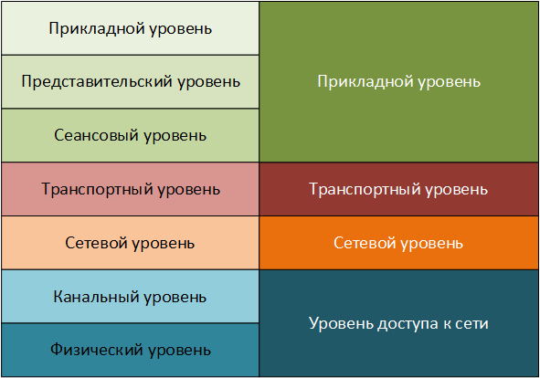
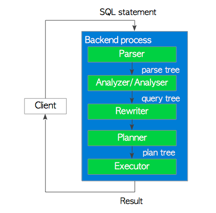
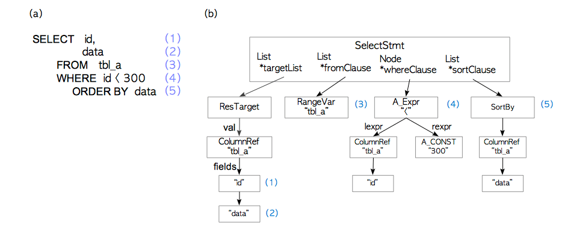
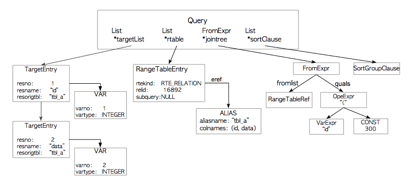
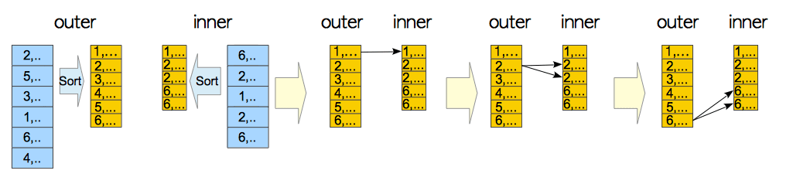
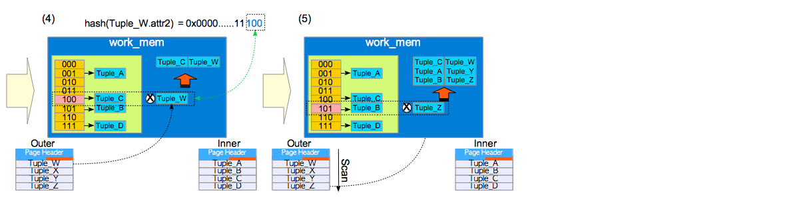
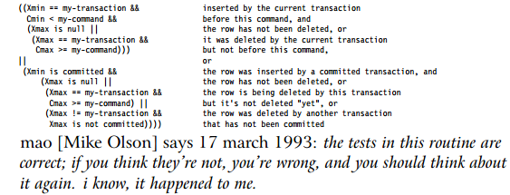
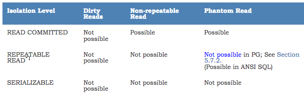

# Lecture 8 - RDBMS Architecture, SQL queries under-the-hood  

## At-a-glance - СУБД и клиент-серверная модель    
*Сервер* - это сама RDBMS (aka СУБД, база, БД, базёнка, базюка ...)  
// RDBMS - relational-database management system, СУБД - система управления базами данных  

    
/* легко путать, но не нужно путать с базой данных - область на файловой системе, в которой находятся объекты, хранящиеся в виде файлов   
// почти всегда база СУБД организуется как структура подкаталогов в хранилище СУБД  
/* схема - некоторое выделенное пространство внутри базы данных   
Термин *database cluster* - набор баз данных, управляемых одним сервером СУБД   

Базовый набор обязанностей сервера СУБД:  
* управляет внутренними файлами базами данных
* принимает соединения от клиентов  
* выполняет действия внутри СУБД от имени пользователей (выборка, удаление, вставка данных, ...)  

*Клиент* - некое приложение, желающее выполнить некоторые операции на СУБД.  
Клиентом может быть любое приложение (настольное, консольное, веб-сервис, специальная IDE - Jetbrains DataGrip к примеру)  
 
Клиент и сервер общаются между собой посредством application-layer протокола.     
  
Этот протокол - прикладного уровня, и в качестве транспорта используется сетевой протокол TCP.  
Примеры других прикладных протоколов - HTTP, Thrift, Oracle TNS, ...  

Многие протоколы СУБД проприентарны.  
Пример устройства протокола PostgreSQL:     
https://www.postgresql.org/docs/current/protocol.html    

## Физическая архитектура СУБД (на примере Postgres)   
Process / Memory architecture отвечают на вопрос - что за что отвечает, как и где хранить  
```
polkitd  21564  0.0  0.1 287444 17664 ?        Ss   Apr01   0:02  |   \_ postgres
polkitd  21776  0.0  0.0 287444  2040 ?        Ss   Apr01   0:00  |       \_ postgres: checkpointer process  
polkitd  21777  0.0  0.0 287444  3088 ?        Ss   Apr01   0:20  |       \_ postgres: writer process  
polkitd  21778  0.0  0.0 287444  2048 ?        Ss   Apr01   0:21  |       \_ postgres: wal writer process  
polkitd  21779  0.0  0.0 287856  2772 ?        Ss   Apr01   0:08  |       \_ postgres: autovacuum launcher process  
polkitd  21780  0.0  0.0 142444  1996 ?        Ss   Apr01   0:06  |       \_ postgres: stats collector process
```
// Как осознать - process, memory, then back to process  
    
* server postgres (`postgres`, в ранних версиях `postmaster`) - самый главный процесс.    
  Он запускает необходимые фоновые процессы, создает зоны памяти, поднимает backend-процесс при клиентских соединениях  
* backend process - клиентская сессия, выполняющая все запрошенные действия от клиента (запросы)  
  Сессия может работать в пределах одной базы.  
  Число сессий - не бесконечно, обычно бывают лимиты  
### Фоновые процессы (самые важные)
* Background writer  
  Запись измененных данных в постоянное хранение  
* Autovacuum Launcher
  Из-за особенностей, в процессе работы порождается мусор (блоки данных), и его надо очищать (автоматически или руками)
* WAL writer
  Сброс содержимого Write-Ahead Log в постоянное хранилище
* Statistics
  Сборка статистике по каждой таблице (чисто строк, уникальные значения, ...)  


### Хранение на файловой системе  
Postgres имеет свой домашний каталог - переменная среды PGDATA  
Некоторые важные подкаталоги PGDATA (для pg 9.6):
* base - каталоги баз данных
* global - служебные таблицы
* pg_clog - данные состояний транзакций
* pg_stat - собранные данные по статистике таблиц
* pg_xlog - файлы Write-ahead Log 


*Tablespace* - по своему разложить таблицы на диске  


`CREATE TABLESPACE fastspace LOCATION '/pgstore/data1';`

```
root@43bef05b003f:/pgstore/data1# ls -al
drwx------. 2 postgres postgres  6 Apr 22 14:50 PG_9.6_201608131
```

```
root@43bef05b003f:/var/lib/postgresql/data/pgdata# ls -al pg_tblspc/
total 4
lrwxrwxrwx.  1 postgres postgres   14 Apr 22 14:50 24577 -> /pgstore/data1
```

По умолчанию:  
* pg_global
* pg_default

*Datafile* физически можно рассматривать можно как heap, разделенный на блоки(страницы) по 8КБ.    
  
Таблицы, индекс - хранятся в одном или более датафайлах  
Датафайлы хранятся tablespace-ах

### Общая память (shared), размещенная в RAM
* shared buffer pool    
  Минимизация чтения из файловой системы. По сути кэш из блоков тяжелых/часто используемых объектов.  
  Если блок из этого пула изменится, он становится "грязным".  
  
* Write-ahead Log  
  Буфер изменений, перед записью на файловую систему, для буферизации изменений (x3 write/modify)
* commit log  
  Хранит сведения обо всех транзакциях 
  
   
### Локальная память (local) - RAM
* work_mem  
  Операционная память для сортировок и джойнов  
* maintenance_work_mem  
  Память для служеных операций (сборка мусора, сборка индекса)
* temp_buffers  
  Память для временных таблиц

## Обработка запроса
Шаги обработки запроса:  
  

Подопытный запрос:  
  ```
  select id, data
  from tbl_a
  where id < 300 
  order by data
  ```

* Parser - преобразование SQL-запроса в parse tree  
  На этой фазе происходит только проверка синтаксиса  
  `Синтаксис определяет как упорядочить, скоординировать и соединить слова в некий текст`     
    
* Analyzer - генерация query tree на основе parse tree  (https://www.postgresql.org/docs/current/querytree.html)  
  Здесь происходит проверка семантики - смысловой нагрузки элементов parse tree    
    
  Происходит полная подстановка значений 
  * например, `select * from tab_a` превратится в `select <all_fields_from_tab_a>`
  * используемые таблицы - подставятся конкретный идентификаторы (object id), и соответствующие им предикаты  
* Rewriter - перобразование query tree эвристиками    
  Достаточно сложная система.  
  Пример - используется view в запросе, то поле RangeTableEntry.subquery будет ссылаться на query tree подзапроса  
* Planner - генерация из query tree нескольких plan tree и выбор наилучшего.  
  Самая сложная из подсистем! Во всех базах данных, и даже в BigData-системах!  
  Cost-based optimization  
    
* Executor - выполнение query tree - хождение по таблицам и индексам в предписанном порядке

## Выполнение запроса - подробней
Каждый элемент plan tree имеет свой реализованный функционал  
https://github.com/postgres/postgres/tree/master/src/backend/executor  
Получить наилучший с точки зрения базы plan tree можно через команду `EXPLAIN`:    
```
Limit  (cost=98070.51..98070.71 rows=10 width=28) (actual time=5503.859..5546.036 rows=10 loops=1)
  ->  GroupAggregate  (cost=98070.51..105041.81 rows=348565 width=28) (actual time=5503.856..5546.030 rows=10 loops=1)
        Group Key: t.passenger_name, t.passenger_id"
        Filter: (count(DISTINCT f.departure_airport) > 4)
        Rows Removed by Filter: 9274
        ->  Sort  (cost=98070.51..98941.92 rows=348565 width=32) (actual time=5494.363..5527.503 rows=26530 loops=1)
              Sort Key: t.passenger_name, t.passenger_id"
              Sort Method: external merge  Disk: 43072kB
              ->  Hash Join  (cost=18960.59..57642.74 rows=348565 width=32) (actual time=385.127..1627.805 rows=1045726 loops=1)
                    Hash Cond: (tf.ticket_no = t.ticket_no)
                    ->  Hash Join  (cost=1341.10..27920.48 rows=348565 width=18) (actual time=47.817..599.844 rows=1045726 loops=1)
                          Hash Cond: (tf.flight_id = f.flight_id)
                          ->  Seq Scan on ticket_flights tf  (cost=0.00..19172.26 rows=1045726 width=18) (actual time=0.033..282.050 rows=1045726 loops=1)
                          ->  Hash  (cost=1203.10..1203.10 rows=11040 width=8) (actual time=47.661..47.661 rows=33121 loops=1)
                                Buckets: 65536 (originally 16384)  Batches: 1 (originally 1)  Memory Usage: 1806kB
                                ->  Hash Join  (cost=10.68..1203.10 rows=11040 width=8) (actual time=0.164..40.570 rows=33121 loops=1)
                                      Hash Cond: (f.arrival_airport = ml_1.airport_code)
                                      ->  Hash Join  (cost=5.34..1045.95 rows=11040 width=12) (actual time=0.086..32.132 rows=33121 loops=1)
                                            Hash Cond: (f.departure_airport = ml.airport_code)
                                            ->  Seq Scan on flights f  (cost=0.00..888.82 rows=11040 width=12) (actual time=0.015..21.930 rows=33121 loops=1)
                                                  Filter: ((scheduled_departure)::date > '2010-09-14'::date)
                                            ->  Hash  (cost=4.04..4.04 rows=104 width=4) (actual time=0.055..0.055 rows=104 loops=1)
                                                  Buckets: 1024  Batches: 1  Memory Usage: 12kB
                                                  ->  Seq Scan on airports_data ml  (cost=0.00..4.04 rows=104 width=4) (actual time=0.002..0.033 rows=104 loops=1)
                                      ->  Hash  (cost=4.04..4.04 rows=104 width=4) (actual time=0.061..0.062 rows=104 loops=1)
                                            Buckets: 1024  Batches: 1  Memory Usage: 12kB
                                            ->  Seq Scan on airports_data ml_1  (cost=0.00..4.04 rows=104 width=4) (actual time=0.005..0.039 rows=104 loops=1)
                    ->  Hash  (cost=9811.33..9811.33 rows=366733 width=42) (actual time=335.791..335.791 rows=366733 loops=1)
                          Buckets: 65536  Batches: 16  Memory Usage: 2164kB
                          ->  Seq Scan on tickets t  (cost=0.00..9811.33 rows=366733 width=42) (actual time=0.017..224.859 rows=366733 loops=1)
Planning time: 3.230 ms
Execution time: 5556.284 ms
```
### Join-операции  
* Nestep-Loop Join (NLJ)
  По сути, вложеннный цикл  
  ```python
  predicate = 'where t1.name = t2.imya'
  result_set = []
  for row_left in table_a:
    for row_right in table_b:
      if row_left.matches(row_right, predicate):
          result_set.append(row_left, row_right)
          # чего-то не хватает!
  ```  
  Вопросы:   
  * какая сложность?     
  * когда такой джойн будет работать ооочень долго?  
  * можно ли убыстрить? (INLJ)   
  Минусы:    
  * Ограничение на предикат (только по равенству)   
* (Sort) Merge Join (SMJ)  
  Вдохновлено сортировкой слиянием (СС) - кто помнит?  По сути это финальная фаза СС.  
  Сортируем обе таблицы и вычисляем результат джойна  
    
  Минусы:  
  * Нужно сортировать таблицы (но иногда они уже заранее отсортированы)
  * Много места может занять
  * Ограничение на предикат (только по равенству)
* Hash Join (HJ)  
  Строится хэш-таблица (2^N бакетов) - хранится в памяти.  
  Строки "внутренней" таблицы раскидываются по бакетам хэш-таблицы. 
  При работе с хэш-таблицей считаем хэш по полям заданного предиката.  
  Затем пробегаем по "внешней" таблице, обращаясь к хэш-таблице и проверяем после по предикату.
    
  Вопросы:  
  * Ничего не напоминает?
  
*Оптимизация запросов* - на 70% состоит из того, как оптимальней сджойнить таблицы!  


## Транзакции
Транзакция - набор изменений, распостраняемых в БД.    
Нельзя не выполнить транзакцию!  
Состояния транзакций:  
* IN_PROGRESS
* ABORTED
* COMMITED
* 

*Вопрос* - можем ли мы изменять один и тот же файл несколькими процессами?   

*ACID* - требования к многопользовательской СУБД:  
* Atomicity - фиксируем изменение, либо не применяем  
* Consistency - не нарушаем корректность БД (не будет семантических нарушений бизнес-модели данных)  
* Isolation - работающие транзакции не мешают друг другу
* Durability - если зафиксировали изменения, то ничего не приведет к их потере

Чтобы обеспечить эти требования, в современных СУБД реализован MVCC - multi-version concurrency control.  
Рассмотрим реализацию в Postgres.  
* У каждой транзакции есть монотонный идентификатор (TID)
* Внутри одной транзакции может быть несколько команд - они пронумерованы с нуля
* Есть глобальный реестр транзакций (pg_clog) - кто еще работает, кто откатился.
* Для каждой строки таблицы есть:  
    * Xmin, Xmax - TID создавшей, TID удалившей  
    * Cmin, Cmax - Номер создавшего/удалившего выражения внутри транзакции   
  
Как MVCC трактует DML-действия (реализация в Postgres):        
### select  
* select - выборка подходящих записей (существовавших до появления транзакции)  
  c_tid > Xmin && (c_tid < Xmax && Xmax != 0) && Xmin not in clog.cancelled      
     
* insert - добавляем запись в свободное место таблицы.    
  проставляем Xmin  
* delete - запись в таблице помечается как устаревшая - но физически она не удаляется      
  проставляем Xmax   
* update - старая запись помечается как устаревшая, затем добавляется новая    
  *Вопрос* - давайте подумаем что будет?    

### vacuum
Подчищает неактуальные строки  

## Уровни изоляции
```
dirty read
    A transaction reads data written by a concurrent uncommitted transaction.

nonrepeatable read
    A transaction re-reads data it has previously read and finds that data has been modified by another transaction (that committed since the initial read).

phantom read
    A transaction re-executes a query returning a set of rows that satisfy a search condition and finds that the set of rows satisfying the condition has changed due to another recently-committed transaction.

serialization anomaly
    The result of successfully committing a group of transactions is inconsistent with all possible orderings of running those transactions one at a time.
```

   
* READ COMMITTED
* REPEATABLE READ
* SERIALIZABLE


# Further read
* Полный свод терминов PostgreSQL - https://en.wikibooks.org/wiki/PostgreSQL/Terms
* Query processing in Postgres - http://www.interdb.jp/pg/pgsql03.html
* Системные столбцы строк Postgres - https://postgrespro.ru/docs/postgrespro/9.5/ddl-system-columns