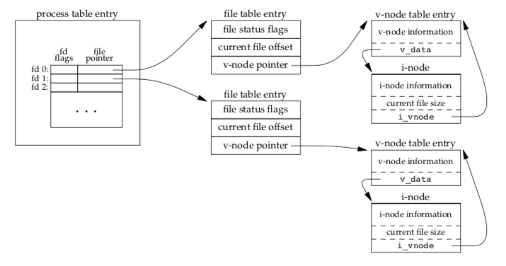
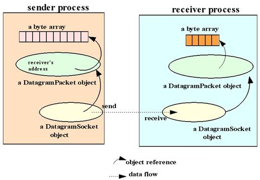
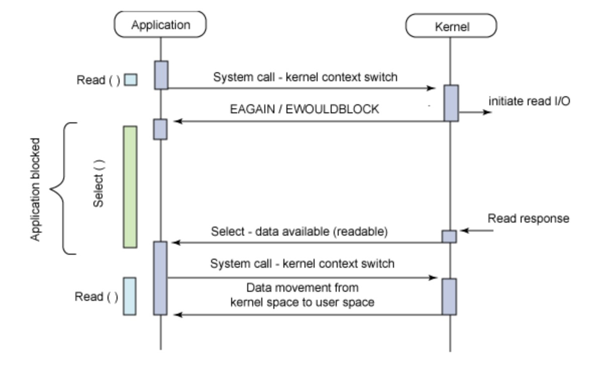
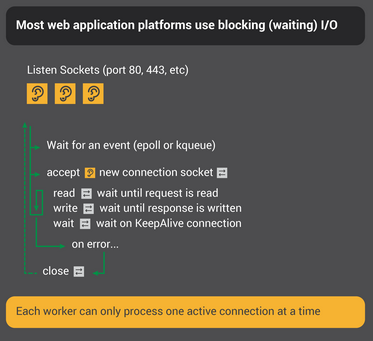
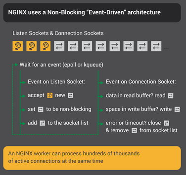

# Lecture 9 - networking, http

# Networking
## HTTP Overview, Terms

HTTP - своего рода "медиа"-курьер в Интернете.    
Мы что-то хотим - и можем получаем ответ - клиент-серверная модель.  
Мы не думаем как нам это сделать - вся низкоуровневая работа уже реализована предыдущими слоями (TCP, IP, ....).  

*Что мы запрашиваем - URL*    
Полная URL-схема:  
`<схема>:[//[<логин>[:<пароль>]@]<хост>[:<порт>]][/<URL‐путь>][?<параметры>][#<якорь>]`    

Пример: https://en.wikipedia.org/wiki/Uniform_Resource_Identifier#URLs_and_URNs  
* use HTTP(s) protocol
* on server en.wikipedia.org
* grab resource /wiki/Uniform_Resource_Identifier    


*Тип данных - MIME*  
https://en.wikipedia.org/wiki/Media_type  
Пример:  
* text/html
* application/zip

*Метод запроса* - какое действие совершить серверу
* GET - send resource from server to client
* PUT - store data from client into named server resource
* POST - send client data to a server
* DELETE - delete named resource from server

*Код ответа запроса* - всегда трехзначный
* 200 - OK
* 404 - not found
* 500 - internal error
При создании своих HTTP-серверов надо придерживаться заданного смысла кодов.  

*Версии HTTP*  
Сейчас доминируют v1.1 и v2. 
Основные отличия:  
* v2 был продавлен google
* v2 - бинарный протокол
* v2 позволяет отдавать клиенту дополнительные ресурсы за один запрос (актуально для богатых контентом страниц)  

*HTTP-сообщения*  
В клиент-сервере всегда обмениваются сообщениями.  
* Start Line - что сделать/что было сделано - метод, адрес ресурса, версия HTTP, код ответа
* Заголовок - key-value, определяющие атрибуты
* Тело запроса - информация (текст/бинарь)

```
(base) EnlightAir:lecture_9 lancer$ curl -i 2ip.ru
HTTP/1.1 200 OK

Server: nginx
Date: Wed, 29 Apr 2020 07:11:36 GMT
Content-Type: text/plain
Content-Length: 14
Connection: keep-alive

37.190.23.107
```  

*Транспорт *  
HTTP подразумевает надежную и последовательную доставку данных неограниченного размера.  
Сначала нужно установить TCP-соединение - у нас уже есть адрес сервера и порт, либо мы узнаем адрес по имени сервера.   
Последнее происходит через DNS - Domain Name Service   
 
Порты - если неуказан порт, по умолчанию - 80 http, 443 https    
https://en.wikipedia.org/wiki/List_of_TCP_and_UDP_port_numbers
К примеру - GET neverssl.com
```
1	0.000000	192.168.1.2	8.8.8.8	DNS	89	Standard query 0x8e28 A kfdlbcnsmrthvxwz.neverssl.com
2	0.074903	8.8.8.8	192.168.1.2	DNS	153	Standard query response 0x8e28 A kfdlbcnsmrthvxwz.neverssl.com A 13.33.47.133 A 13.33.47.80 A 13.33.47.26 A 13.33.47.241
6	0.107518	192.168.1.2	13.33.47.133	HTTP	478	GET /online HTTP/1.1 
10	0.137736	13.33.47.133	192.168.1.2	HTTP	71	HTTP/1.1 200 OK  (text/html)
``` 


## Sockets & Ports  
Открывая файл, мы вызываем системный вызов `open(2)` и получаем файловый дескриптор.  
Каждый процесс имеет таблицу открытых дескрипторов  
Ядро ОС поддерживает таблицу всех открытых файлов  


`Everything in UNIX is a file`  
Практически все в nix сводится к файлу.  
`ls` может показать тип файла:  
* `-` - regular file
* `d` - directory
* `l` - symbolic link - ссылка на файл/каталог
* `c` - character device file (терминалы/периферийные устройства)
* `b` - block device file (память)
* `s` - socket file
* `p` - named pipe

*Сокет - "разъем"*  
Любой транспорт (TCP, UDP) всегда устанавливает передачу через два сокета - на передачу и прием.
Сокеты бывают сетевыми и IPC. 
Сетевые сокеты: 
* Datagram - просто отправляем пакет, который индивидуально маршрутизируется и доставлется
  Несколько процессов могут слать данные через один сокет
  Порядок доставки - не опрееделен
  
* Stream - устанавливаем соединение и надежно передаем последовательный поток данных   
      
Реализация сокетов лежит на протоколе.  
Posix Socket API (нечто похожее есть и у винды):   
https://en.wikipedia.org/wiki/Berkeley_sockets#Socket_API_functions  
* socket(domain, type, protocol) - создать сокет  
  domain: {AF_INET, AF_UNIX}  
  type: {SOCK_STREAM, SOCK_DGRAM}  
  protocol: {IPPROTO_TCP, IPPROTO_UDP}  
* bind() - привязывает сокет к конкретному адресу и порту - `{ip_addr, port_number}` (сервер)
  Сетевой порт - целое число - абстрация. Во всех транспортах получатель/отправитель - адрес+порт.  
  Cокет не может работать с данными пока сокет не ассоциирован с портом
* listen() - перевод сокета в состояние прослушки (сервер)
* connect() - присваивает сокету свободный порт (клиент)
* accept() - принять входящее соединение и создать новый сокет
* send/recv() - отправить/получить данные
* close() - закрыть соединение и сокет

Давайте сделаем свой простенький TCP-сервис:  
```
simple_tcp_server.py
simple_tcp_client.py
```

Запустим две сессии клиента и посмотрим lsof:   
lsof - list open files and processes using them  
`lsof -iTCP | grep python`


## Simple HTTP server
https://docs.python.org/3/library/http.server.html   
Давайте сделаем свой простенький HTTP-сервачок:  
```
simple_http_server.py
```  
Посмотрим на то, что он делает  

*Polling*  
Ожидание наступления события (прилетели данные в socket) - позволим нас лишь уведомить.   
Аналогия из жизни - уход за младенцем - можем вечно стоять над ним, либо поставить рацию и приходить только на крики.    
  
https://docs.python.org/3/library/selectors.html  
Polling считается ключевым компонентом асинхронного IO, но само по себе это не "асинхронщина".  
    
Прежде всего - мультиплексирование IO.
Считаем и запишем - ждем одно и ждем другое:  
```python
while True:
    n = read(read_tty, buf)
    if n > 0:
        if write(write_tty, buf, n) != n:
            log.critical("IO error")
        else:
            log.info("Success")
```
Если файл - то норм, а если это интерактивный ввод/вывод?  
Файловые дескрипторы можно выставить в неблокирующий режим.  
```python
fd_read, fd_write = open_fd(read_tty, write_tty)

def ready_func(sock):
    conn, addr = sock.accept()
    selector.register(conn, EVENT_READ, write_func)

def write_func(sock):
    conn, addr = sock.accept()
    data = conn.recv(10000)
    if data:
        fd_write.write(data)
        conn.close()

selector.register(fd_read, EVENT_READ, callback=ready_func)
while True:
    events = selector.select()
    for e in events:
        e.callback()
```
  
read() vs epoll():  
* для read мы ждем только один дескриптор
* epoll позволяет нам ожидать события по нескольким дескрипторам
* не тратим вхолостую CPU - read постоянно проверяет готовность буфера   
  (системные вызовы почти никогда не работают напрямую с IO, ну кроме вещей типа fsync)

## Nginx
(c) Гроссмейстер соединений  
https://habr.com/ru/post/260065/  

С давних времен был главным Apache.  
Проблема его - 10к соединений (на каждый коннект - отдельный поток, пока не коннект не завершился - поток блокирован)   
https://en.wikipedia.org/wiki/C10k_problem  

  
Затем пришел Nginx и всех уделал.     
   
Активный сокет распределен по всем воркерам    
Новое соединения порождают новый сокеты   
Далее воркер мониторит (polling) сокеты соединений и если пришли данные - возвращается мгновенный ответ  
Но воркеры в целом не резиновые и исчерпать лимит открытых дескрипторов можно, придется тюнить  
https://medium.com/@cubxi/nginx-too-many-open-files-error-solution-for-ubuntu-b2adaf155dc5  
  
*Nginx обязателен при работе в проме!* - чтобы снизить нагрузку и уберечься от ботов.      
Выставить питоновский сервер в интернет - для сервера это как уронить мыло в тюрьме...  

## CGI 
Ранний интернет был статичным.  
Набросал страничку, сервак ее раздал.  

Со временем появилась потребность в динамической генерации контента.  
Сервера начали учиться запускать скрипты при обработке http-запроса.  
Так появился CGI.  

Сервер и запущенный скрипт общались через стандартные стримы и переменные среды.  
Пример с википедии:  
```perl
#!/usr/bin/perl
print "Content-Type: text/plain\n\n";
for my $var ( sort keys %ENV ) {
    printf "%s = \"%s\"\n", $var, $ENV{$var};
}
> curl http://example.com/cgi-bin/printenv.pl/foo/bar?var1=value1&var2=with%20percent%20encoding
Response:  
DOCUMENT_ROOT="C:/Program Files (x86)/Apache Software Foundation/Apache2.4/htdocs"
GATEWAY_INTERFACE="CGI/1.1"
HTTP_ACCEPT="text/html,application/xhtml+xml,application/xml;q=0.9,*/*;q=0.8"
HTTP_ACCEPT_CHARSET="ISO-8859-1,utf-8;q=0.7,*;q=0.7"
HTTP_ACCEPT_ENCODING="gzip, deflate, br"
HTTP_ACCEPT_LANGUAGE="en-us,en;q=0.5"
HTTP_CONNECTION="keep-alive"
HTTP_HOST="example.com"
HTTP_USER_AGENT="Mozilla/5.0 (Windows NT 6.1; WOW64; rv:67.0) Gecko/20100101 Firefox/67.0"
SERVER_ADDR="127.0.0.1"
SERVER_ADMIN="(server admin's email address)"
SERVER_NAME="127.0.0.1"
SERVER_PORT="80"
SERVER_PROTOCOL="HTTP/1.1"
SERVER_SIGNATURE=""
SERVER_SOFTWARE="Apache/2.4.39 (Win32) PHP/7.3.7"
```  
https://en.wikipedia.org/wiki/Common_Gateway_Interface  

Проблемы:  
* Большой оверхед - каждый запрос поднимал новый CGI-процесс
* Небезопасно - неэкранированные данные приводили к произвольному исполнению кода 
  
Одно из удачных решений - FastCGI.  
Суть - поднять пул воркеров.  

## WSGI 
Приложения Python для веба деплоились по разному - через cgi/fastcgi/mod_python/....   
Решили сделать единый интерфейс веб-сервера - PEP 333  
https://www.python.org/dev/peps/pep-0333/  

Роли остались прежними:  
* Server/Gateway - специальный веб-сервер(nginx/apache) или некий application server
* Application/Framework - python callable

WSGI определяет: 
* какие параметры должен принять callable и что должно вернуть серверу 
    * пространство переменных среды передаваемых для обработки  
    * спецификацию потокового ввода, буферизация    
    * обработку заголовков и других фичей HTTP

WSGI не определяет: 
* как именно запускать интепретатор
* как инициализировать приложение 
  
*Пайплайнинг обработки запроса*  
Некоторый callable могут использоваться для дополнительной обработки запроса - фильтрация/валидация/авторизация/...   
WSGI определяет это как middleware  
   
## Werkzeug  
Самая функциональная библиотека для работы с WSGI.
Что должна уметь WSGI-библиотека?  
* обработка заголовков
* отправка и прием cookies
* обеспечить доступ к данным HTML-форм
* ...

Werkzeug - не сервер. Но есть модуль-сервер.
Состряпаем свой сервачок на Werkzeug.  
```
werkzeug_demo/zeug.py
```   
Для тестов сервера возьмем requests.  
```
import requests
r = requests.post('http://localhost:5001/bigdata', data={'name': 'евпатий'})
```

## Gunicorn
WSGI HTTP Server
```
pip install gunicorn
cd werkzeug_demo
gunicorn -w 2 zeug:create_app 
```
